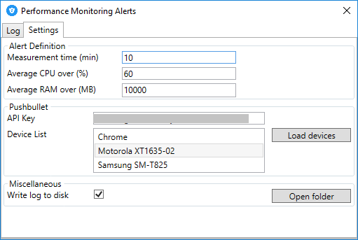
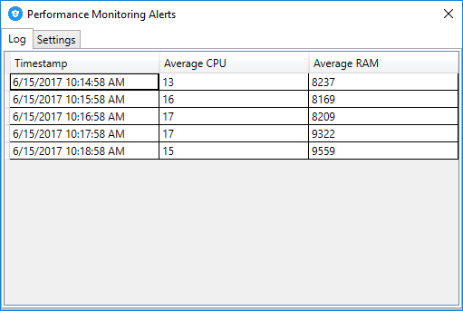

# Performance Monitoring Alerts

This application was written to monitor the CPU and RAM on a server. If the CPU or RAM goes beyond the entered threshold the application will send a [Pushbullet](https://www.pushbullet.com/) notification to all configured devices.

